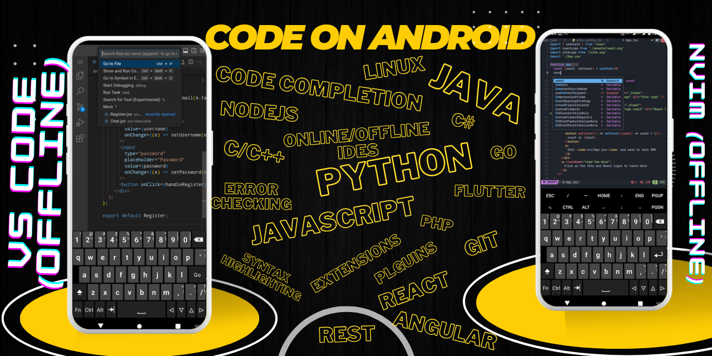

# <h1 align="center">CODE ON ANDROID</h1>

This repository provides information and guides on the best ways and tools to code on Android. It covers both online and offline editors, including their features and setup instructions.

## Table of Contents
1. [Online Editors](#online-editors)
    - [IDEX](#idex)
    - [Repl.it](#repl-it)
2. [Offline Editors](#offline-editors)
    - [VS Code](#vs-code)
    - [Neovim](#neovim)
    - [Acode](#acode)
3. [Supporting Languages](#supporting-languages)
    - [Java](#java)
    - [JavaScript](#javascript)
    - [C/C++](#cc)
4. [Termux Setup](#termux-setup)
    - [Node.js](#nodejs)
    - [Code Server](#code-server)
    - [Neovim](#neovim-termux)

## Online Editors

### IDEX
IDEX is a powerful online editor that supports multiple languages and has a rich set of features for coding on Android.

- **Features:**
  - Syntax highlighting
  - Code completion
  - Integrated terminal
  - Git integration

### Repl.it
Repl.it is another versatile online editor that supports collaborative coding and has a user-friendly interface.

- **Features:**
  - Real-time collaboration
  - Multiple language support
  - Integrated console
  - Cloud-based

## Offline Editors

### VS Code
VS Code is a popular code editor with extensive extensions and customization options.

- **Features:**
  - IntelliSense
  - Debugging
  - Built-in Git
  - Extensions marketplace

#### Installation Guide:
1. Install [Termux](https://play.google.com/store/apps/details?id=com.termux) from the Play Store.
2. Update and upgrade packages:
    ```sh
    pkg update && pkg upgrade
    ```
3. Install Node.js:
    ```sh
    pkg install nodejs
    ```
4. Install Code Server:
    ```sh
    npm install -g code-server
    ```
5. Start Code Server:
    ```sh
    code-server
    ```
6. Access VS Code in your browser using the provided local URL.

### Neovim
Neovim is a highly configurable text editor, ideal for power users.

- **Features:**
  - Modal editing
  - Highly customizable
  - Lightweight
  - Vim script support

#### Installation Guide:
1. Install Neovim:
    ```sh
    pkg install neovim
    ```
2. Configure Neovim using your `.config/nvim/init.vim` file.

### Acode
Acode is a lightweight code editor for Android with support for various languages and Git.

- **Features:**
  - Syntax highlighting
  - Git integration
  - Multiple tabs
  - FTP/SFTP support

## Supporting Languages

### Java
Install Java Development Kit (JDK) on Termux:
```sh
pkg install openjdk-17
```

## Contributing

We welcome contributions! Please see our [Contributing Guidelines](CONTRIBUTING.md) for more information on how to get started.
